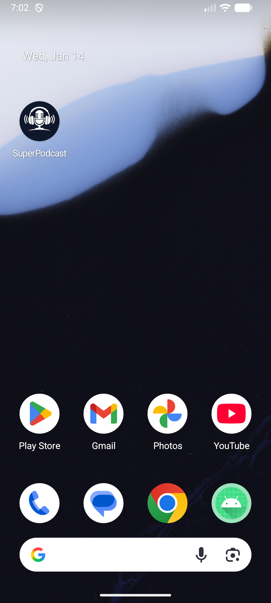
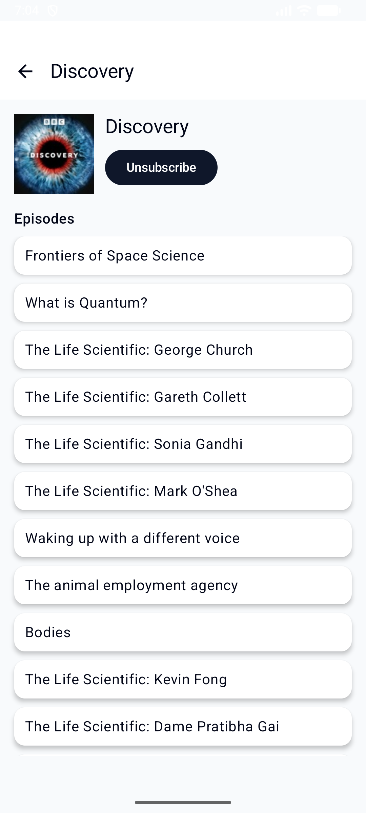
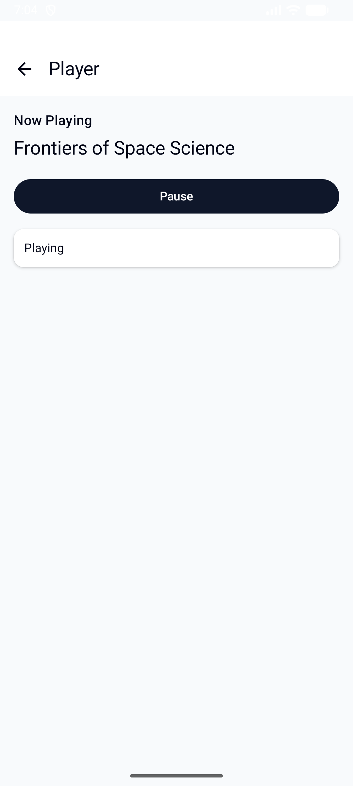
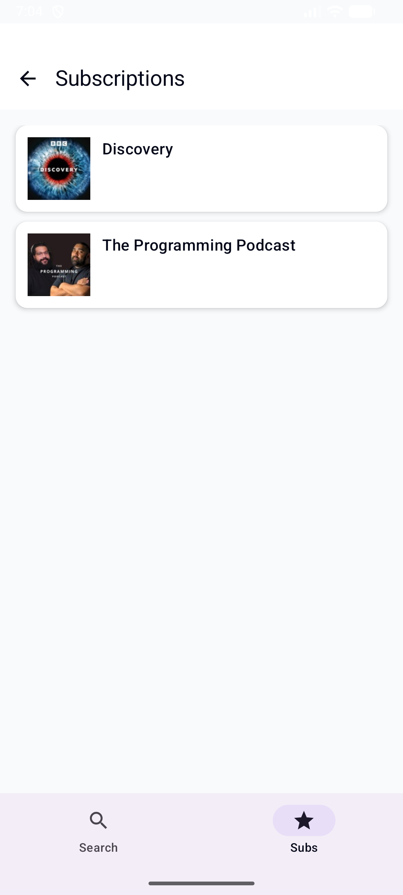

# SuperPodcast  
Android Development – Assignment 7 & 8

SuperPodcast is a podcast browsing and playback app built with Jetpack Compose.  
This project was developed to practice API integration, RSS parsing, media playback, local data persistence, navigation, and UI theming using modern Android development tools.

---

## What the app does

- Search for podcasts using the iTunes Search API  
- View podcast details and episode lists parsed from RSS feeds  
- Play and pause podcast episodes using ExoPlayer (Media3)  
- Subscribe and unsubscribe to podcasts  
- View saved subscriptions using local storage  
- Navigate between screens using Jetpack Navigation  
- Use bottom navigation for primary app sections  

---

## Architecture and Technologies

- **Language:** Kotlin  
- **UI:** Jetpack Compose (Material 3)  
- **Architecture:** MVVM (ViewModels + Repository pattern)  
- **Networking:** Retrofit (REST API), OkHttp  
- **RSS Parsing:** XML parsing  
- **Media Playback:** Media3 / ExoPlayer  
- **Local Storage:** Room (SQLite)  
- **Navigation:** Jetpack Navigation Compose  

---

## App Screens

- **Search Screen**  
  Allows users to search for podcasts by keyword and navigate to subscriptions.

- **Podcast Detail Screen**  
  Displays podcast artwork, subscription controls, and a list of available episodes.

- **Player Screen**  
  Plays podcast episodes with proper playback state handling and back navigation.

- **Subscriptions Screen**  
  Displays podcasts saved locally by the user.

---

## Assignment 8 Enhancements

The following updates were added for Assignment 8:

- Custom app launcher icon  
- Updated Material 3 theme and color scheme  
- Improved visual styling for cards and backgrounds  
- Bottom navigation bar for primary screens (Search and Subscriptions)  
- Consistent top app bars with back navigation on detail and player screens  

---

## Screenshots

### App Icon

---

### Search Screen

---

### Podcast Detail Screen

---

### Player Screen

---

### Subscriptions Screen

---

## Subscriptions

When a user taps **Subscribe**, the podcast is saved locally using Room.  
Subscribed podcasts can be viewed later on the Subscriptions screen, even after restarting the app.

---

## How to run the app

1. Clone this repository  
2. Open the project in Android Studio  
3. Allow Gradle to finish syncing  
4. Run the app on an emulator or physical device (API level 24 or higher)

---

## Assignment Notes

This project was created as part of an Android Development course.  
Assignments 7 and 8 focused on functionality, architecture, UI design, navigation, and demonstrating understanding of modern Android development concepts.

---

## Author

Kenneth Plumstead  
Mobile Web Development Student
